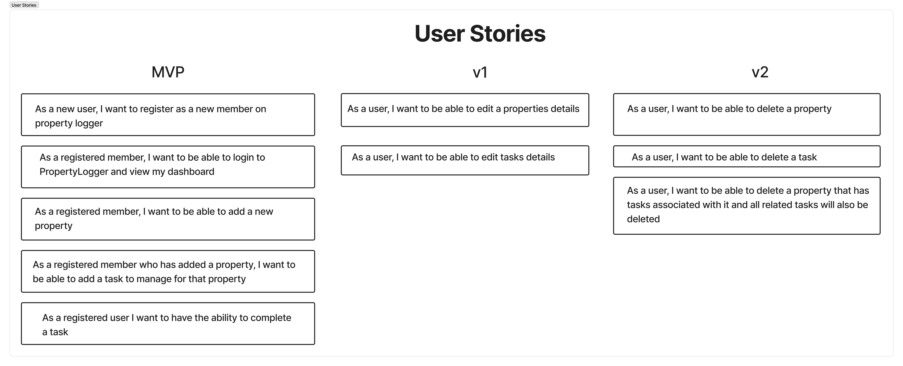

# PropertyLogger
PropertyLogger is an application that allows users to sign up, add properties and manage tasks for those properties.

## Why PropertyLogger?
Well, I've been a personal journey to learn more about software architecture over the past few years. Rather than
doing another vanilla task manager, I thought why not try and make it more useful while throwing a few wrinkles of
functionality in as well.

## Testing
Testing will be a hard requirement for this project. There will be a mix of unit, integration and end-to-end tests while
working to practice TDD/BDD. Acceptance tests are a new concept for me, so I'm excited to see how they can help highlight
the value we are delivering.

## Approach
In most of my personal projects, it's mostly been all about diving straight into code and trying to figure out what the
latest toolset is out there that I can learn and use.

For PropertyLogger, I am going to use a different approach. Like Khalil teaches over on [Essentialist.dev](https://essentialist.dev),
I will be trying to **clarify before coding**. I'll be using a combination of impact mapping, user story mapping and 
writing out acceptance tests to help guide the development of this project.

Find and deliver the value.

## Login/Registration
I've never used an external service for auth before, but we will be using Auth0 for this project. It should result in
some interesting decisions around testing.

## Impact Map

## User Story Map
User story mapping is a new concept to me, but wow, what a game-changer. Even on personal projects it's so easy to focus
so much on the code that you end up not having any real goals or milestones in place. It's easy to never know what done
looks like.

User story mapping is a great way to be able to easily identify what's most important and what should be worked on
first. It's a great way to keep the focus on the user and what they need.

## User Stories

## Acceptance Tests
